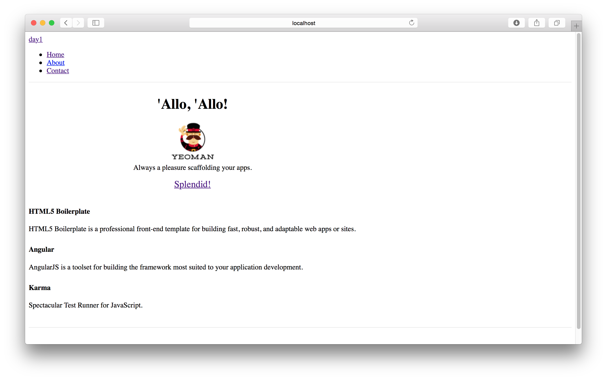

# プロジェクト作成

0. 好きなところに新しいフォルダを作りましょう
	* 推奨ディレクトリ `~/Document/Dev/Web/NodeJsBootcamp/Day1`
0. Terminal.appを起動
0. `cd` を入力
0. `半角スペース` を入力
0. 先ほど作った新しいフォルダをTerminal.appにドラック＆ドロップ
0. Terminal.appを一度クリックし、 `enter`
	
	赤線部分が同じになることを確認
0. `yo angular` と入力して `enter`
0. `? Would you like to use Sass (with Compass)? (Y/n)` と表示される
	* `n` と入力して `enter`
0. `? Would you like to include Bootstrap? (Y/n)` と表示される
	* `n` と入力して `enter`
0. 以下が表示される
	``` bash
	? Which modules would you like to include? (Press <space> to select)
	❯◉ angular-animate.js
	 ◯ angular-aria.js
	 ◉ angular-cookies.js
	 ◉ angular-resource.js
	 ◯ angular-messages.js
	 ◉ angular-route.js
	 ◉ angular-sanitize.js
	 ◉ angular-touch.js
	```
	十字キーで `angular-aria.js` にカーソルを合わせて `space`  
	``` bash
	? Which modules would you like to include? (Press <space> to select)
	 ◉ angular-animate.js
	❯◉ angular-aria.js
	 ◉ angular-cookies.js
	 ◉ angular-resource.js
	 ◯ angular-messages.js
	 ◉ angular-route.js
	 ◉ angular-sanitize.js
	 ◉ angular-touch.js
	```
	上のような表示に変わったことを確認して `enter`
0. 以下の画面で動作が止まる
	
	`enter`
0. `grunt serve` と入力し `enter` でサーバーを開始
0. 以下のような画面がブラウザ上で表示されたらプロジェクト作成成功
	
	Bootstrapという機能が有効になっていないので若干寂しい画面になります
0. Terminal.appに戻り `control` + `c` でサーバーを終了
