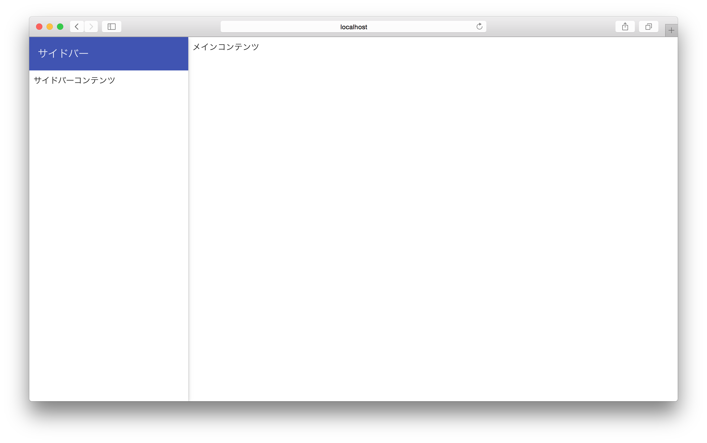

# プロジェクトの設定

## angular-materialの設定

### bowerからインストール

0. Terminal.appを開き、 `cd` でプロジェクトのディレクトリに移動する  
	[プロジェクト作成](CreateProject.html)の最後の状態からならば使っていたTerminal.appを使う
0. `bower install --save angular-material` と入力し `enter`

### index.htmlの変更

Atomで `app/index.html` を開く

``` html
<!-- Add your site or application content here -->
<div class="header">
  <div class="navbar navbar-default" role="navigation">
    <div class="container">
      <div class="navbar-header">

        <a class="navbar-brand" href="#/">day1</a>
      </div>

      <div class="collapse">

        <ul class="nav navbar-nav">
          <li class="active"><a href="#/">Home</a></li>
          <li><a ng-href="#/about">About</a></li>
          <li><a ng-href="#/">Contact</a></li>
        </ul>
      </div>
    </div>
  </div>
</div>

<div class="container">
<div ng-view=""></div>
</div>

<div class="footer">
  <div class="container">
    <p><span class="glyphicon glyphicon-heart"></span> from the Yeoman team</p>
  </div>
</div>


<!-- Google Analytics: change UA-XXXXX-X to be your site's ID -->
 <script>
   !function(A,n,g,u,l,a,r){A.GoogleAnalyticsObject=l,A[l]=A[l]||function(){
   (A[l].q=A[l].q||[]).push(arguments)},A[l].l=+new Date,a=n.createElement(g),
   r=n.getElementsByTagName(g)[0],a.src=u,r.parentNode.insertBefore(a,r)
   }(window,document,'script','https://www.google-analytics.com/analytics.js','ga');

   ga('create', 'UA-XXXXX-X');
   ga('send', 'pageview');
</script>

<!-- build:js(.) scripts/vendor.js -->
```
上記の部分のコードを
``` html
<!-- Add your site or application content here -->
<div ng-controller="AppCtrl" layout="column" style="height:100%;" ng-cloak>
	<section layout="row" flex>
		<md-sidenav class="md-sidenav-left md-whiteframe-z2" md-component-id="left" md-is-locked-open="$mdMedia('gt-md')">
			<!-- サイドバーコンテンツ -->
			<md-toolbar class="md-theme-indigo">
				<h1 class="md-toolbar-tools">サイドバー</h1>
			</md-toolbar>
			<md-content layout-padding ng-controller="LeftCtrl">
				<md-button ng-click="close()" class="md-primary" hide-gt-md>
					サイドバーを閉じる
				</md-button>
				<div>
					サイドバーコンテンツ
				</div>
			</md-content>
			<!-- サイドバーコンテンツ -->
		</md-sidenav>

		<md-content flex layout-padding>
			<!-- メインコンテンツ -->
			<div layout="column" layout-fill layout-align="top center">
				<md-button ng-click="toggleLeft()" class="md-primary" hide-gt-md>
					サイドバーを表示
				</md-button>
			</div>
			<div>
				メインコンテンツ
			</div>
			<!-- メインコンテンツ -->
		</md-content>
	</section>
</div>

<!-- build:js(.) scripts/vendor.js -->
```
上に変更

## controllerの実装

0. `scripts/controllers/sidenav.js` をAtomから作成
0. 以下のコードを実装
	``` JavaScript
	'use strict';

	angular
		.module('day1App', ['ngMaterial'])
		.controller('AppCtrl', function($scope, $timeout, $mdSidenav, $mdUtil, $log) {
			$scope.toggleLeft = buildToggler('left');

			function buildToggler(navID) {
				var debounceFn = $mdUtil.debounce(function() {
					$mdSidenav(navID).toggle();
				}, 0);
				return debounceFn;
			}
		})
		.controller('LeftCtrl', function($scope, $timeout, $mdSidenav, $log) {
			$scope.close = function() {
				$mdSidenav('left').close();
			};
		});

	```

## controllerをindex.htmlに読み込む

index.htmlの
``` html
<script src="scripts/app.js"></script>
<script src="scripts/controllers/main.js"></script>
<script src="scripts/controllers/about.js"></script>
```
の部分に
``` html
<script src="scripts/controllers/sidenav.js"></script>
```
を追加

## テスト
Terminal.appに `grunt serve` と入力して `enter`

成功していれば上のような画面が表示される（サイドバーが隠れている場合もある）
