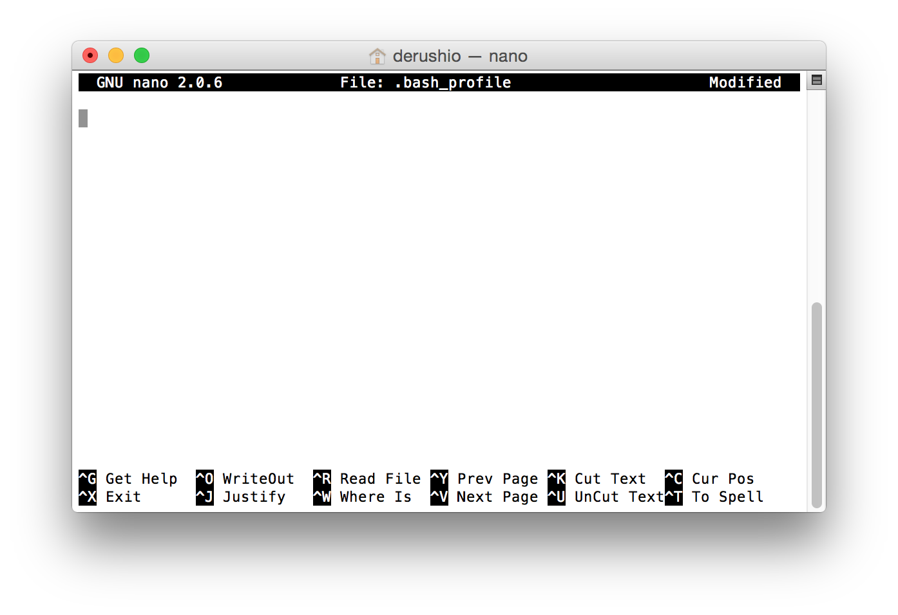
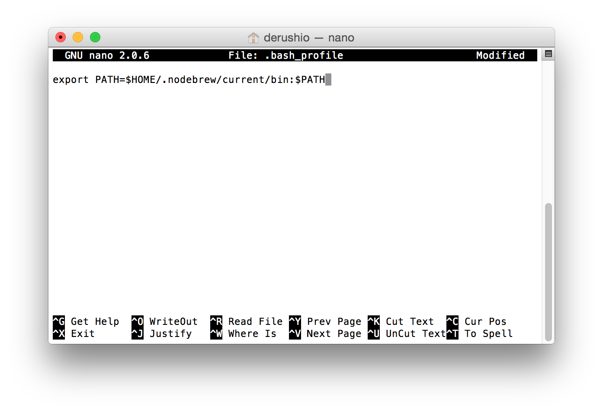
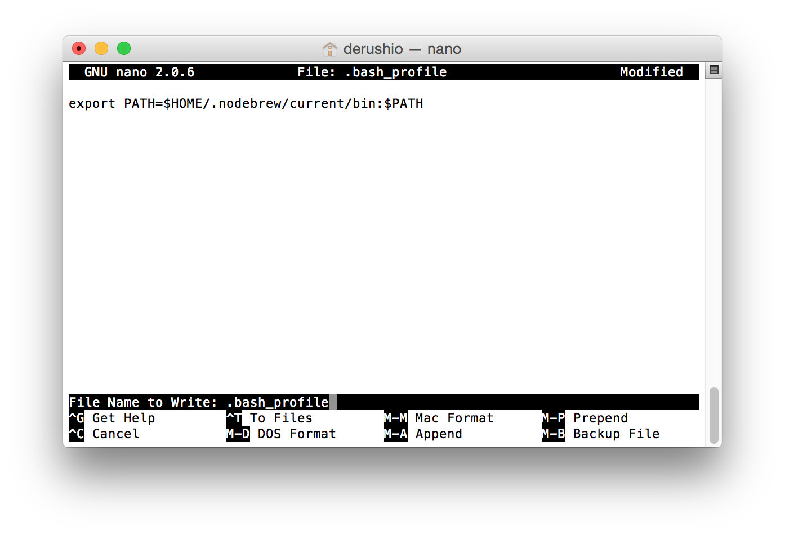
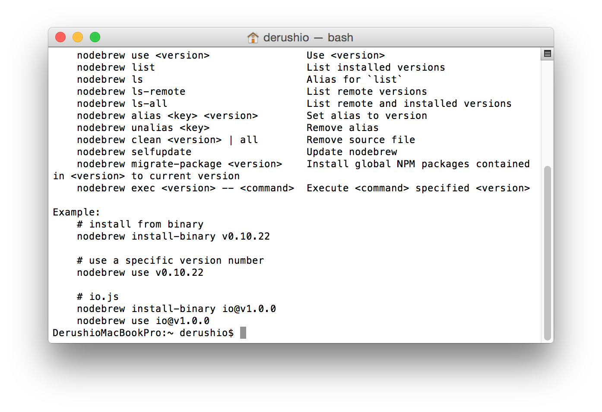
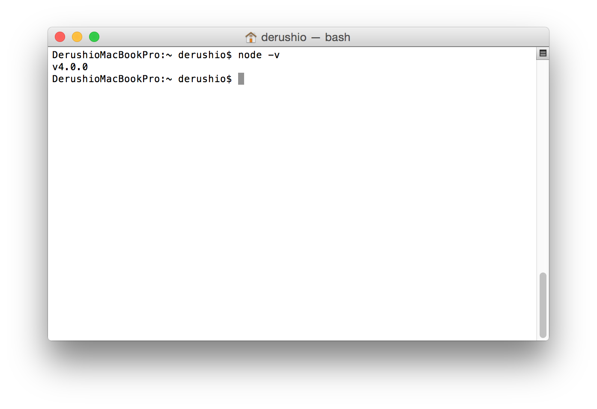

# Node.js

## nodebrew
### 0. すでにインストールされている場合は削除
##### もしくは、このページを無視する  
`node` を実行して何か反応がある場合は下のコマンドを一行づつ実行  

`curl -o uninstall-node.sh https://gist.githubusercontent.com/nicerobot/2697848/raw/uninstall-node.sh`  
`chmod u+x uninstall-node.sh`  
`./uninstall-node.sh`  
`rm uninstall-node.sh`  
`sudo rm -rf /usr/local/include/node`  
`sudo rm -rf /usr/local/lib/dtrace`  
`rm -rf ~/.node-gyp`  
`rm -rf ~/.npm`  
`rm -rf ~/.sourcemint`

### 1. インストール
0. Terminal.appを開く
0. `curl -L git.io/nodebrew | perl - setup` を入力して `enter`  
	終了すると
	``` bash
	Add path:

	export PATH=$HOME/.nodebrew/current/bin:$PATH
	```
	と画面に表示される
0. `cd ~/` を入力して `enter`
0. `pico .bash_profile` を入力して `enter`
	
0. `export PATH=$HOME/.nodebrew/current/bin:$PATH` を貼り付ける
	
0. `control` + `o`
	
0. `enter`
0. `source .bash_profile` を入力して `enter`
0. `nodebrew` を入力して `enter`  
	ここまででnodebrewのインストールは終了  
	成功していれば
	
	上の画面のように反応がある

### 2. Node.jsをnodebrewにインストール
0. `nodebrew install-binary stable` を入力して `enter`
0. `nodebrew use stable`  
	ここまででNode.jsのインストールは終了  
	`node -v` を入力して `enter` 後に
	
	この画面のようにバージョンが表示されていれば成功
