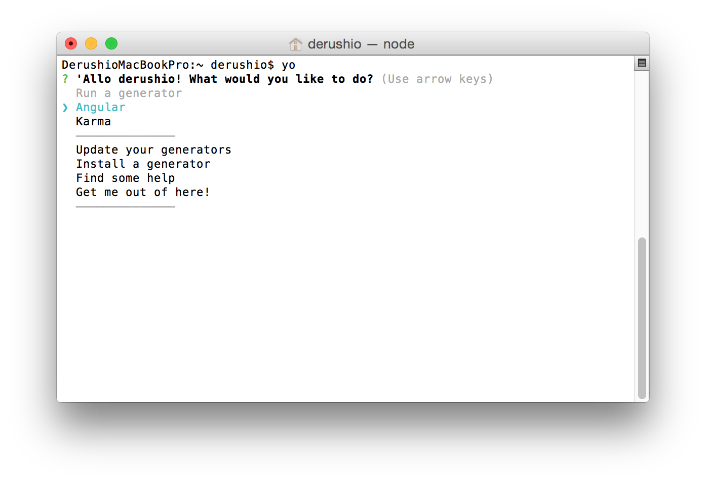

# Node.js

**原則として `sudo` は禁止（わからない人は無視してください）**

## nodebrew
### 1. インストール
0. Terminal.appを開く
0. `curl -L git.io/nodebrew | perl - setup` を入力して `enter`  
	終了すると
	```bash
	Add path:

	export PATH=$HOME/.nodebrew/current/bin:$PATH
	```
	と画面に表示される
0. `cd ~/` を入力して `enter`
0. `pico .bash_profile` を入力して `enter`
	
0. `export PATH=$HOME/.nodebrew/current/bin:$PATH` を貼り付ける
	
0. `control` + `o`
	
0. `enter`
0. `source .bash_profile` を入力して `enter`
0. `nodebrew` を入力して `enter`  
	ここまででnodebrewのインストールは終了  
	成功していれば
	
	上の画面のように反応がある

### 2. Node.jsをnodebrewにインストール
0. `nodebrew install-binary stable` を入力して `enter`
0. `nodebrew use stable`  
	ここまででNode.jsのインストールは終了  
	`node -v` を入力して `enter` 後に
	
	この画面のようにバージョンが表示されていれば成功

## npmの設定
0. `npm update` を入力して `enter`
0. `npm install -g yo bower grunt-cli` を入力して `enter`  
	しばらく時間がかかります
0. `npm install -g generator-angular` を入力して `enter`
0. `yo` を入力して `enter`  
	
	上のような画面が表示されていれば成功  
	`control` + `c` でこの画面を抜ける
